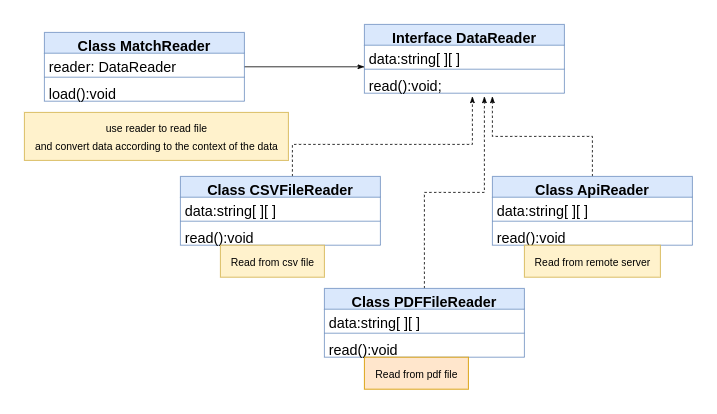

# Reusible File Reader

We want to read from multiple types of files `txt|json|csv|pdf` etc... \
we need to read files in different format from our local machine,
or a remote server and writing code that implements the logic for
each of these files can be `very tedious` and `repetitive` which is
something that we are supposed to ovide while writing codes.

The current application needs to read data from a csv file, do some processing then generates a report. The logic is pretty straightforward but the problem is how to make this app `open to change` if we decide to change the data source.We want to be able to read from multiple types of files without changing the core of our program.

## Data Source

Our Data source is csv file that contains information about football matches.

| Date       | HomeTeam    | Away Team | Home Team Goals | Away Team Goals | Winner | Referee    |
| :--------- | :---------- | :-------- | :-------------- | :-------------- | :----- | :--------- |
| 12/08/2018 | Arsenal     | Man City  | 0               | 2               | A      | M Oliver   |
| 12/08/2018 | Liverpool   | West Ham  | 4               | 0               | H      | A Taylor   |
| 12/08/2018 | Southampton | Burnley   | 0               | 0               | D      | G Scott    |
| 18/08/2018 | Cardiff     | Newcastle | 0               | 0               | D      | C Pawson   |
| 18/08/2018 | Chelsea     | Arsenal   | 3               | 2               | H      | M Atkinson |
| ...        | ...         | ...       | ...             | ...             | ...    | ...        |

## Design Solution

The Design show that the **concrete class** `MatchReader` **delegates** the reading of data to an appropriate object that is responsible of
implementing the logic of reading a file from a data source.
The Reader object might be an instance of PDFFileReader, CSVFileReader, APIReader wich reads data from a remote server or any other Reader the app might needs in the future thus `MatchReader` does not depends on concrete classes.

## How everything fits together
